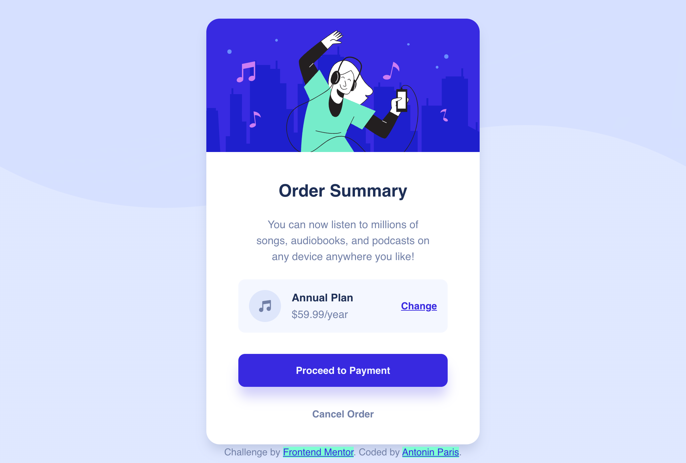

# Frontend Mentor - Order summary card solution

This is a solution to the [Order summary card challenge on Frontend Mentor](https://www.frontendmentor.io/challenges/order-summary-component-QlPmajDUj). 

## Table of contents

- [Overview](#overview)
  - [The challenge](#the-challenge)
  - [Screenshot](#screenshot)
  - [Links](#links)
- [My process](#my-process)
  - [Built with](#built-with)
  - [What I learned](#what-i-learned)
  - [Continued development](#continued-development)
  - [Useful resources](#useful-resources)
- [Author](#author)
- [Acknowledgments](#acknowledgments)

## Overview

### The challenge

Users should be able to:

- See hover states for interactive elements

### Screenshot

### Links

- [Solution URL](https://your-solution-url.com)
- [Github repo]()

## My process

### Built with

- Semantic HTML5 markup
- CSS custom properties
- Flexbox

### What I learned

* To better structure my html with BEM method
* To have a good responsive design is hard
* Managing flexbox

### Continued development

I would like to improve my css structure and learn about scss.  

Learning javascript with a new project.

### Useful resources

- [flex](https://css-tricks.com/snippets/css/a-guide-to-flexbox/) - This helped me for understanding and managing flexbox.
- [box-shadow](https://html-css-js.com/css/generator/box-shadow/) - This is useful to create shadows for your box.

## Author

- Website - [anparis](https://anparis.github.io/)
- Frontend Mentor - [@anparis](https://www.frontendmentor.io/profile/anparis)

## Acknowledgments

I was inspired by @kens-visuals solution when I was feeling stuck with my design.